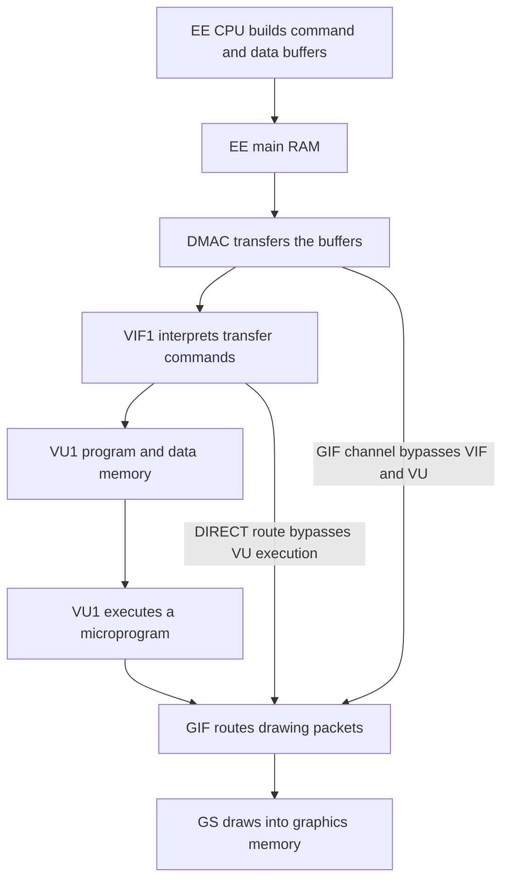

# M1 — PS2 architecture orientation

Prepared 2026-09-13. BUILD: guide prepared. VERIFY: architecture references
reviewed; no GT4 execution capture performed. EXPLAIN: pending M1 tutoring.

## Objective and motivation

Be able to follow work from game code to pixels, and explain the separate I/O
service boundary. This determines which parts of GT4Recomp need translated
instructions and which need runtime behavior.

One hypothetical failure motivates the lesson: our generated CPU code fills a
command buffer correctly, then waits forever. Correct arithmetic alone cannot
make a data-transfer engine complete its work. We must identify the missing
observable behavior before implementing it.

## The processors and memory

| Part | Responsibility |
| --- | --- |
| Emotion Engine (EE) | Contains the R5900 CPU core and cooperating processing/transfer units; EE is broader than its CPU core. |
| COP0 | CPU system control, including exception and address-translation state. |
| COP1 / FPU | Scalar floating-point computation. |
| VU0 / COP2 | Vector computation tightly coupled to the CPU. Macro mode exposes operations through CPU instructions; micro mode runs a VU program. |
| VU1 | Runs vector microprograms and can supply drawing packets to GIF. |
| Scratchpad | 16 KiB of explicitly used fast working memory, distinct from the automatic CPU cache. |

A microprogram is a program for a vector unit, with its own instruction format.
Translating R5900 instructions does not also translate VU microinstructions.
VU0 is not limited to macro mode. [Sony EE Overview, sections 2.2–2.3](https://usermanual.wiki/Pdf/EEOverviewManual.870871663.pdf)

The retail system has 32 MB main RAM. The IOP is a separate I/O processor;
SPU2 handles sound, and GS is the Graphics Synthesizer. These are distinct
responsibilities, even when host implementations eventually share a process.
[Sony SCEE introductory architecture slides, slide 12](https://www.slideserve.com/sldsrv/introduction-to-ps2-powerpoint-ppt-presentation)

## Follow a graphics packet



DMAC means DMA controller; DMA is direct memory access, transferring blocks
without a CPU load/store loop for every element. GIF is the graphics interface;
GS performs drawing. Transfer, computation and drawing are different stages.
[Sony EE Overview, sections 2.5 and 3.1–3.3](https://usermanual.wiki/Pdf/EEOverviewManual.870871663.pdf)

VIF is the vector interface. Its command stream can upload microinstructions
with MPG, unpack data into VU memory with UNPACK, and start a microprogram with
MSCAL. DIRECT sends drawing data onward without executing VU1. These commands
are not R5900 instructions. The three arrows into GIF represent alternative
routes; a drawing packet need not visit every box.
[PS2SDK packet2 command definitions](https://ps2dev.github.io/ps2sdk/group__packet2__types.html)

## Worked example: one synthetic triangle

This is a teaching scenario, not a captured GT4 packet or executable program.
Assume a valid vector program transforms three vertices and creates drawing
data. We have deliberately omitted packet encodings and synchronization details.

1. The EE prepares vertices, a transform and transfer commands in a buffer.
2. A transfer delivers the buffer to VIF1.
3. VIF1 places the required data/program in VU1 memory and starts execution.
4. The vector program transforms the vertices and supplies a drawing packet.
5. GIF forwards the packet; GS uses its drawing state to produce pixels.

Prediction exercise: suppose step 2 reports completion but copied no data.
Step 3 no longer receives the intended inputs, so a correct step 4 cannot
establish the expected triangle. A runtime that simply returns success would
hide the first failure and make the later symptom harder to explain.

Another experiment: inspect input VU memory before running the vector program.
If it already differs from the reference, investigate preparation, transfer and
unpacking before modifying vector arithmetic. This is a proposed debugging
experiment; we have not executed it.

## I/O and services

The IOP runs an R3000-family software environment distinct from the EE's R5900
environment. SIF, the sub-CPU interface, connects their communication. At the
software level, requests can be remote procedure calls: one processor asks a
service on the other to perform work and return a result.
[Sony EE Overview, section 2.6](https://usermanual.wiki/Pdf/EEOverviewManual.870871663.pdf)

PS2SDK exposes separate IOP modules and EE-facing services for file/disc access,
controllers, sound and SIF communication. A pad service supplies controller
state; a CD/DVD service supplies requested disc data. SPU2 belongs to the sound
path, not the graphics path. These interfaces help us frame experiments; they
do not establish GT4's particular request formats.
[PS2SDK module reference](https://ps2dev.github.io/ps2sdk/modules.html)

```text
EE game code <-> SIF requests/results <-> IOP services
                                         | disc/files
                                         | controller state
                                         | sound/SPU2
```

For this project, implementing an observed service contract may be sufficient;
we have not decided to translate every IOP program. A service contract includes
arguments, returned data, errors and completion behavior, not just a success code.

## Connection to our implementation

| Future project slice | Observable result to validate |
| --- | --- |
| EE decoder/interpreter/recompiler | Registers, memory changes and control flow |
| Guest memory/runtime | Addressed reads/writes and hardware-visible effects |
| DMA and VIF | Transferred bytes and resulting VU memory/state |
| VU | Output registers, memory and emitted packets |
| GIF and GS | Drawing state and resulting pixels |
| IOP/SIF services | Requests, responses, data and completion behavior |

These are future responsibilities, not new C++ classes introduced by this
milestone. The current executable still only prints the laboratory banner.
Actual GT4 USA v2.00 usage, ordering and addresses require later observation.
Timing, caches, interrupts and arbitration are deliberately beyond this first
map; they are not declared unnecessary. IPU image processing is another unit
to investigate if observed execution requires it.

## Understanding checkpoint

1. Why can perfectly translated EE arithmetic still leave the program waiting
   forever for graphics work?
2. What changes between VIF placing data in VU memory and VU executing on it?
3. How does VU0 macro execution differ from a VU1 microprogram? Can VU0 also
   execute a microprogram?
4. Does every GS packet pass through VU1? Describe an alternative route.
5. Why is a disc-read service returning success insufficient without the
   requested bytes and appropriate completion behavior?

Explain the main graphics path without the diagram, and independently explain
why the IOP exists. M1 remains pending understanding assessment. The next
milestone, M2, completes reproducible input fingerprinting for the selected disc.
